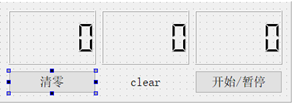
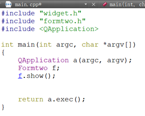

# 最终测试（答辩时间：9月2日19：00）（任选一个）


## 后台任务
使用Flask框架，编写一个博客具有登入注册发布文章等功能
- 需要有文档解释代码，建议使用markdown语言


## 前端任务
为在培训课上做出的音乐播放器添加以下功能：
- 添加专辑的封面，歌单
- 添加时长
- 添加下载功能
- 添加 显示歌词功能
- 需要有文档解释代码，建议使用markdown语言

## 应用程序端

Qt程序实例如下，设计一个简易的计时器界面，功能有开始，暂停，中止，以及这三种状态的提示。完成空缺部分。
```
#ifndef FORMTWO_H
#define FORMTWO_H
#include <QWidget>
#include "qtimer.h"

namespace Ui {class Formtwo;}
class Formtwo : public QWidget
{
    Q_OBJECT
public:
    explicit Formtwo(QWidget *parent = 0);
    ~Formtwo();
private:
    Ui::Formtwo *ui;
    QTimer *MyTimer;//是一个定时器类，每隔一段时间发送timeout()信号
public://时分秒
    int second;
    int minute;
    int hour;
signals://信号
    void s2();
    void s3();
public slots://公有槽函数
    void t1();
    void t2();
    void t3();
private slots://私有槽函数
    void on_button_run_stop_clicked();
 （一）_________________________________
};
#endif // FORMTWO_H
    


源文件
#include "formtwo.h"
#include "ui_formtwo.h"

Formtwo::Formtwo(QWidget *parent) :
    QWidget(parent),
    ui(new Ui::Formtwo)
{
    ui->setupUi(this);
    second=0;
    minute=0;
    hour=0;
    MyTimer = new QTimer(this);
 (二)_______________________________________________________________
    connect(this,SIGNAL(s2()),this,SLOT(t2()));
    connect(this,SIGNAL(s3()),this,SLOT(t3()));
}
Formtwo::~Formtwo()
{
    delete MyTimer;
    delete ui;
}
void Formtwo::t1()
{
    second+=1;
    if(second==60)
    {
        second=0;
        emit s2();//发送s2()信号
    }
    ui->lcdNumber_3->display(second);//改变显示数字
}
void Formtwo::t2()
{
    minute+=1;
    if(minute==60)
    {
        minute=0;
       （三）__________________
    }
    ui->lcdNumber_2->（四）_______________________
}
void Formtwo::t3()
{
    hour+=1;
    if(hour==24)
    {
        hour=0;
    }
    ui->lcdNumber->display(hour);
}
void Formtwo::on_button_run_stop_clicked()
{
    if(MyTimer->isActive())//如果定时器在工作

    {
        MyTimer->stop();
        ui->label->setText("stop");//改变显示文本
    }
    else
    {
        MyTimer->start(1000);//每一秒发送一个timeout()信号
        ui->label->setText("start");
    }
}
void Formtwo::on_button_clear_clicked()
{
    second=0;
    minute=0;
    hour=0;
    ui->lcdNumber->display(0);
    ui->lcdNumber_2->display(0);
    ui->lcdNumber_3->display(0);
    ui->label->setText("clear");
    if(MyTimer->isActive())
    {
        MyTimer->stop();
    }
}

```
ui文件
 
Main函数



